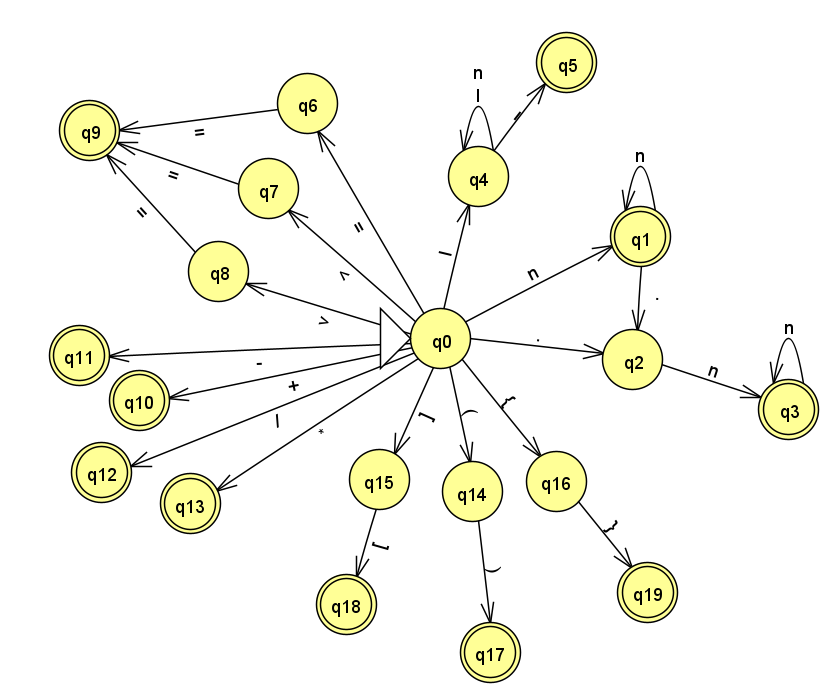

📄 Analizador Léxico — Calculadora Básica
Este proyecto implementa un analizador léxico sencillo usando Python, diseñado para leer un archivo fuente y reconocer tokens válidos según un lenguaje específico basado en operaciones matemáticas básicas (como las de una calculadora).

📌 1. Definición del Lenguaje
📋 Estructura de los programas que acepta
El programa reconoce líneas de texto que representen expresiones matemáticas simples con variables y números. Ejemplos:

```
x = 3 + 5
resultado = (x - 2) * 4
```

Cada línea debe seguir la sintaxis esperada y contener únicamente los símbolos definidos a continuación.

🧠 Instrucciones que reconoce
El lenguaje acepta las siguientes instrucciones:
Asignación de valores (por ejemplo, x = 5)
Operaciones aritméticas: suma (+), resta (-), multiplicación (*), división (/)
Uso de paréntesis para agrupar operaciones
Números enteros o decimales
Variables alfabéticas (letras)

✅ Sintaxis de cada instrucción
Variables: Letras (como a, x, resultado)
Números: Secuencias de dígitos (123, 3.14)
Operadores: +, -, *, /
Paréntesis: (, )
Asignación: =

Ejemplo de sintaxis válida:

```
y = (4 + x1) * 3
```

🔍 2. Funcionamiento del Analizador
El programa abre un archivo fuente de texto.
* Lee línea por línea.

* Reconoce cada token válido (número, operador, identificador, etc.).

* Muestra un mensaje de éxito por cada token reconocido.

Si encuentra un símbolo inválido, lanza un error indicando el carácter y su ubicación.

📊 3. Autómata Gráfico



🛠️ 4. Ejecución
Asegúrate de tener Python 3 instalado.

Coloca el archivo fuente a analizar en el mismo directorio.

Ejecuta el programa con:

```
python run.py
```

Sigue las instrucciones en consola.

💬 5. Ejemplo de salida
Para una línea como:

```
x = 3 + 5
```
El analizador mostrará:

```
Token reconocido: IDENTIFICADOR (x)
Token reconocido: IGUAL (=)
Token reconocido: NÚMERO (3)
Token reconocido: OPERADOR (+)
Token reconocido: NÚMERO (5)
```

🚫 6. Manejo de errores
Si se encuentra un símbolo desconocido como @, se mostrará:

```
Error: carácter no reconocido '@' en la línea 1, posición 5.
```

🧠 Créditos
Este analizador fue desarrollado como parte del curso Teoría de Autómatas y Compiladores.
