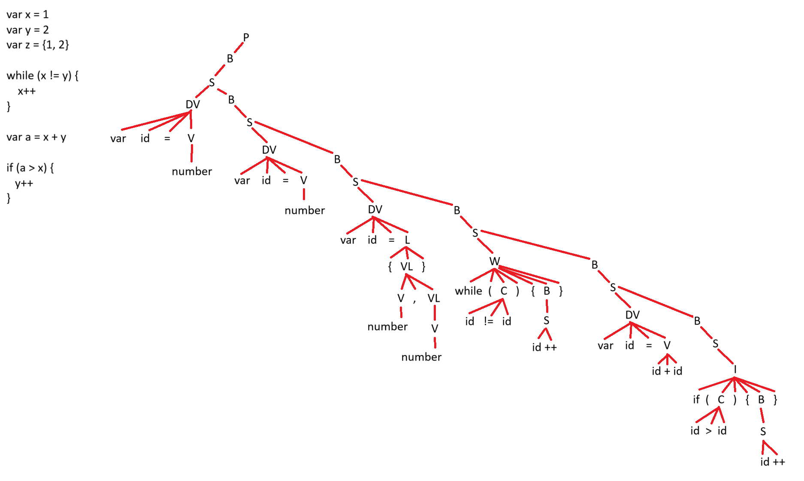

```bash
<PROGRAMA> -> <BLOQUE DE CODIGO>

<BLOQUE DE CODIGO> -> <SENTENCIA>
<BLOQUE DE CODIGO> -> <SENTENCIA> <BLOQUE DE CODIGO>

<SENTENCIA> -> <DECLARACION VARIABLE>
<SENTENCIA> -> <WHILE>
<SENTENCIA> -> <IF>
<SENTENCIA> -> id ++
<SENTENCIA> -> id --

<DECLARACION VARIABLE> -> var id = <VALOR>
<DECLARACION VARIABLE> -> var id = <LISTA>

<VALOR> -> string
<VALOR> -> number
<VALOR> -> boolean
<VALOR> -> id + id
<VALOR> -> id - id
<VALOR> -> id * id
<VALOR> -> id / id

<LISTA> -> {<VALOR LISTA>}

<VALOR LISTA> -> number
<VALOR LISTA> -> number, <VALOR LISTA>

<WHILE> -> while (<CONDICION>) { <BLOQUE DE CODIGO> }

<IF> -> if (<CONDICION>) { <BLOQUE DE CODIGO> }

<CONDICION> -> id == id
<CONDICION> -> id != id
<CONDICION> -> id > id
<CONDICION> -> id < id
<CONDICION> -> id <= id
<CONDICION> -> id >= id

```

